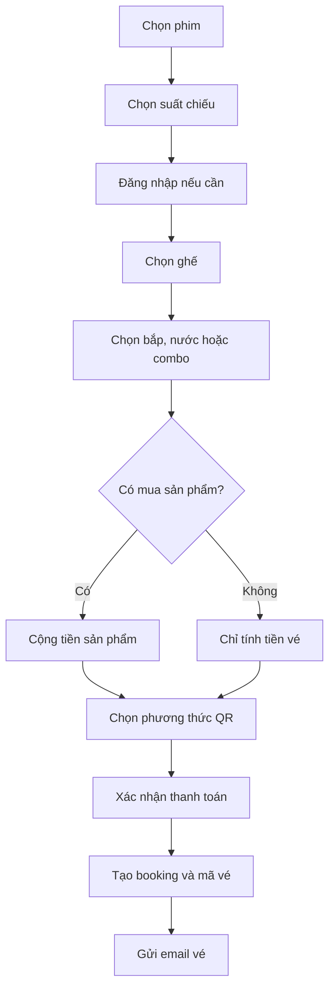
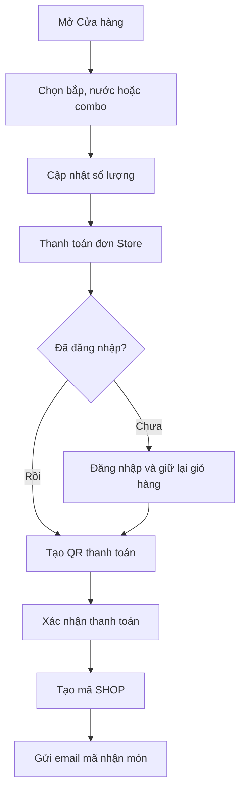
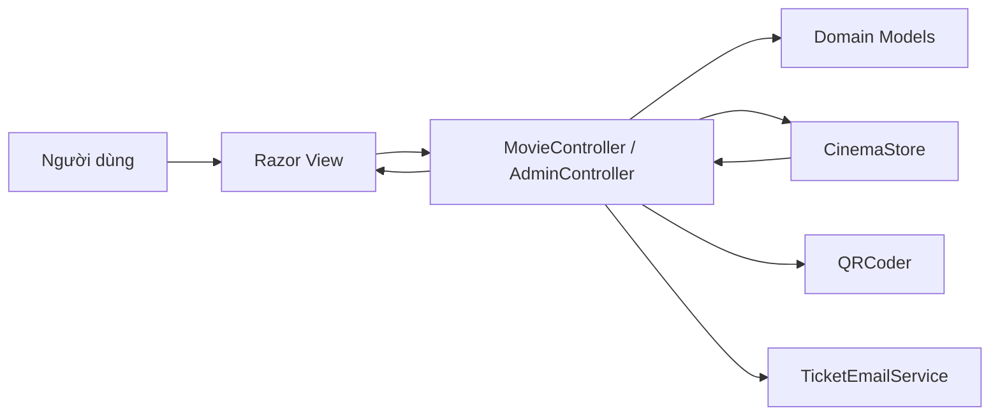
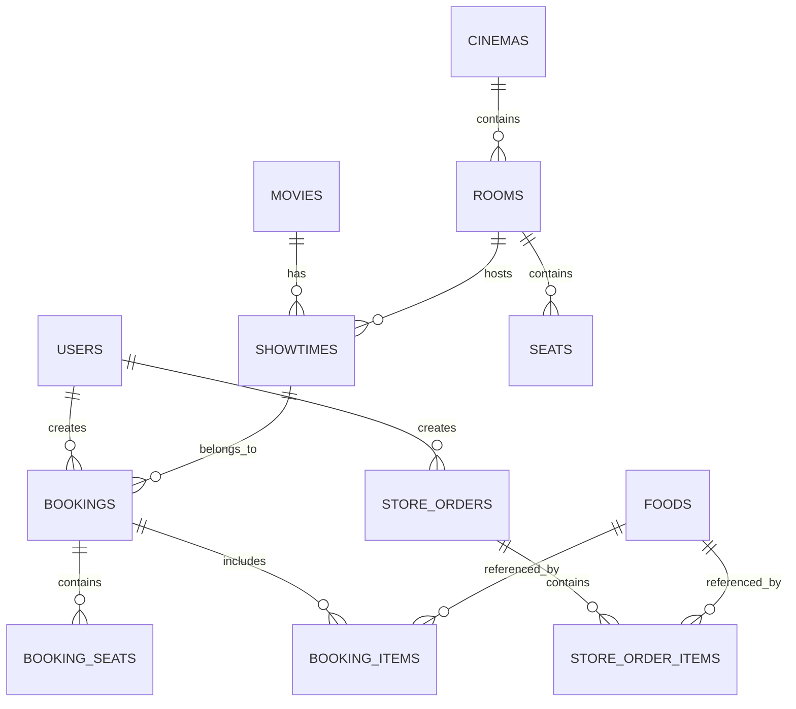

# TRƯỜNG ĐẠI HỌC CÔNG NGHỆ TP.HCM (HUTECH)

## KHOA CÔNG NGHỆ THÔNG TIN

### ĐỒ ÁN CƠ SỞ - CHUYÊN NGÀNH QUỐC TẾ  
### HUTECH UNIVERSITY INTERNATIONAL

---

# BÁO CÁO ĐỒ ÁN CƠ SỞ

## ĐỀ TÀI: WEB MOVIETICKET

**Giảng viên hướng dẫn:** Nguyễn Huy Cường  
**Nhóm thực hiện:** Nhóm 2  
**Năm học:** 2025 - 2026

| STT | Họ và tên | MSSV |
|---:|---|---:|
| 1 | Đặng Lê Thái Phong | 2380604964 |
| 2 | Sơn Nhật Hoàng | 2380600742 |
| 3 | Nguyễn Đình Phước | 2380601769 |

**TP. Hồ Chí Minh, tháng 06 năm 2026**

---

# LỜI CẢM ƠN

Nhóm 2 xin chân thành cảm ơn giảng viên Nguyễn Huy Cường đã hướng dẫn, góp ý và hỗ trợ nhóm trong quá trình thực hiện đồ án cơ sở với đề tài **Web MovieTicket**.

Thông qua đồ án, nhóm có cơ hội vận dụng kiến thức về lập trình web, mô hình MVC, thiết kế giao diện, xử lý nghiệp vụ đặt vé, quản lý tài khoản, thanh toán QR, gửi email và quản trị hệ thống. Quá trình thực hiện giúp các thành viên hiểu rõ hơn cách phân tích yêu cầu, tổ chức mã nguồn, kiểm thử và hoàn thiện một sản phẩm web có quy trình nghiệp vụ tương đối đầy đủ.

Do giới hạn về thời gian và kinh nghiệm, báo cáo và sản phẩm không tránh khỏi thiếu sót. Nhóm mong nhận được nhận xét từ giảng viên để tiếp tục cải thiện hệ thống trong tương lai.

---

# NHẬN XÉT CỦA GIẢNG VIÊN

............................................................................................

............................................................................................

............................................................................................

............................................................................................

**Điểm:** ..................................................................................

**Chữ ký giảng viên:** ......................................................................

---

# MỤC LỤC

1. Tổng quan đề tài  
2. Khảo sát và phân tích yêu cầu  
3. Phân tích và thiết kế hệ thống  
4. Công nghệ và quá trình hiện thực  
5. Kết quả, kiểm thử và đánh giá  
6. Kết luận và hướng phát triển  
7. Tài liệu tham khảo  
8. Phụ lục  

---

# CHƯƠNG 1. TỔNG QUAN ĐỀ TÀI

## 1.1. Lý do chọn đề tài

Nhu cầu xem phim tại rạp ngày càng phổ biến, trong khi khách hàng mong muốn có thể tra cứu phim, chọn suất chiếu, chọn ghế và thanh toán nhanh chóng mà không phải xếp hàng tại quầy. Bên cạnh việc bán vé, rạp phim còn cung cấp các sản phẩm như bắp rang, nước uống và combo.

Từ nhu cầu trên, nhóm lựa chọn xây dựng **Web MovieTicket**, một website đặt vé xem phim trực tuyến với thương hiệu mô phỏng **PHP Cinema**. Hệ thống hướng đến trải nghiệm trực quan, dễ sử dụng trên máy tính và thiết bị di động.

## 1.2. Mục tiêu đề tài

- Xây dựng website giới thiệu và tìm kiếm phim.
- Hiển thị phim đang chiếu, phim hot, phim sắp chiếu và suất chiếu sớm.
- Cho phép người dùng xem thông tin phim, rạp và lịch chiếu.
- Cho phép đăng ký, đăng nhập và quản lý phiên người dùng.
- Xây dựng quy trình chọn suất chiếu, chọn ghế và thanh toán.
- Hỗ trợ QR ngân hàng, MoMo, ZaloPay và VNPay ở mức mô phỏng.
- Gửi vé điện tử hoặc mã nhận món qua email.
- Xây dựng Store bán bắp, nước và combo độc lập với việc mua vé.
- Xây dựng trang quản trị dành cho tài khoản Admin.
- Tạo giao diện hiện đại, responsive và hỗ trợ tiếng Việt.

## 1.3. Phạm vi đề tài

### Phạm vi đã thực hiện

- Quản lý danh sách 20 phim và hình ảnh poster.
- Phân trang, tìm kiếm và lọc phim theo thể loại.
- Banner phim tự động chuyển slide.
- Hiển thị sự kiện, ưu đãi, phim hot, phim sắp chiếu và suất chiếu sớm.
- Hiển thị danh sách rạp, phòng và suất chiếu.
- Chọn ghế thường hoặc ghế VIP.
- Chọn thêm bắp, nước hoặc combo khi đặt vé.
- Cho phép bỏ qua Store và chỉ thanh toán tiền vé.
- Cho phép mua sản phẩm Store mà không cần xem phim.
- Tạo mã QR thanh toán theo từng phương thức.
- Tạo vé điện tử và mã nhận món.
- Gửi email thông qua SMTP hoặc lưu bản email HTML dự phòng.
- Quản trị phim, rạp, suất chiếu, sự kiện, người dùng và trạng thái vé.
- Lưu trạng thái vận hành vào file JSON để dữ liệu vẫn còn sau khi ứng dụng khởi động lại.
- Cho phép Admin tải poster phim trực tiếp từ máy tính.
- Bảo toàn lịch sử vé bằng cách chặn xóa phim hoặc suất chiếu đang có dữ liệu liên quan.

### Giới hạn hiện tại

- Hệ thống sử dụng `CinemaStore` kết hợp file `App_Data/cinema-state.json` để lưu dữ liệu bền vững, chưa sử dụng SQL Server làm kho dữ liệu chính.
- File JSON phù hợp với quy mô đồ án và một tiến trình web; chưa phù hợp với hệ thống nhiều máy chủ hoặc lượng truy cập lớn.
- QR thanh toán hiện là QR mô phỏng, chưa tích hợp API Merchant và webhook thật.
- Gửi email thật yêu cầu cấu hình tài khoản SMTP trong `Web.config`.
- Hệ thống chưa có chức năng hoàn tiền và hủy giao dịch tự động.

## 1.4. Đối tượng sử dụng

### Khách chưa đăng nhập

- Xem danh sách và chi tiết phim.
- Tìm kiếm, lọc phim.
- Xem rạp, lịch chiếu, sự kiện và ưu đãi.
- Xem và chọn sản phẩm trong Store.
- Đăng ký hoặc đăng nhập.

### Khách hàng đã đăng nhập

- Thực hiện toàn bộ chức năng của khách chưa đăng nhập.
- Chọn suất chiếu và ghế.
- Mua vé và sản phẩm kèm theo.
- Mua riêng bắp, nước hoặc combo.
- Thanh toán bằng QR.
- Xem vé và đơn Store đã mua.
- Nhận vé hoặc mã đơn qua email.

### Quản trị viên

- Xem tổng quan hệ thống.
- Thêm, sửa, xóa phim.
- Quản lý rạp và phòng chiếu.
- Quản lý suất chiếu.
- Quản lý sự kiện và ưu đãi.
- Xem người dùng và phân quyền.
- Xem đơn đặt vé, doanh thu và cập nhật trạng thái vé.

---

# CHƯƠNG 2. KHẢO SÁT VÀ PHÂN TÍCH YÊU CẦU

## 2.1. Yêu cầu chức năng

| Mã | Chức năng | Mô tả |
|---|---|---|
| F01 | Đăng ký | Tạo tài khoản khách hàng mới |
| F02 | Đăng nhập | Xác thực và tạo phiên người dùng |
| F03 | Xem phim | Hiển thị danh sách, poster và trạng thái phim |
| F04 | Tìm kiếm phim | Tìm theo tên hoặc thể loại |
| F05 | Lọc thể loại | Chỉ hiển thị phim thuộc thể loại được chọn |
| F06 | Phân trang | Chia danh sách phim thành nhiều trang |
| F07 | Xem chi tiết | Hiển thị nội dung, thời lượng, đạo diễn, diễn viên và đánh giá |
| F08 | Xem lịch chiếu | Hiển thị ngày, giờ, rạp và phòng chiếu |
| F09 | Chọn ghế | Chọn ghế còn trống, phân biệt ghế thường và VIP |
| F10 | Chọn sản phẩm | Chọn bắp, nước hoặc combo kèm vé |
| F11 | Mua Store độc lập | Mua sản phẩm không cần đặt vé |
| F12 | Thanh toán QR | Sinh QR ngân hàng, MoMo, ZaloPay hoặc VNPay |
| F13 | Xem vé | Hiển thị mã vé và thông tin suất chiếu |
| F14 | Xem đơn Store | Hiển thị mã nhận món và danh sách sản phẩm |
| F15 | Gửi email | Gửi vé hoặc mã nhận món đến email người dùng |
| F16 | Quản trị phim | Admin thêm, sửa, upload poster, ngừng chiếu hoặc xóa phim hợp lệ |
| F17 | Quản trị rạp | Admin thêm, sửa, xóa rạp |
| F18 | Quản trị suất chiếu | Admin thêm, sửa, xóa và tạo lại lịch chiếu |
| F19 | Quản trị sự kiện | Admin quản lý ưu đãi |
| F20 | Quản trị người dùng | Admin xem và phân quyền tài khoản |

## 2.2. Yêu cầu phi chức năng

- Giao diện rõ ràng, hiện đại và nhất quán.
- Website hiển thị tốt trên desktop, tablet và điện thoại.
- Dữ liệu đầu vào được kiểm tra ở phía server.
- Form POST sử dụng Anti-Forgery Token để hạn chế CSRF.
- Mật khẩu mẫu được băm bằng SHA-256 trước khi lưu trong bộ nhớ.
- Người dùng thường không thể truy cập trang quản trị.
- Hệ thống kiểm tra ghế hợp lệ và ghế đã đặt trước khi thanh toán.
- Số lượng sản phẩm được giới hạn từ 0 đến 10 cho mỗi loại.
- QR có thời gian hết hạn để mô phỏng giao dịch thực tế.
- Khi SMTP chưa cấu hình, hệ thống vẫn tạo vé và lưu bản email dự phòng.
- Mọi thay đổi quản trị, tài khoản và giao dịch được ghi xuống file JSON bằng thao tác thay thế file an toàn.
- Poster upload chỉ chấp nhận JPG/PNG, tối đa 5 MB và kích thước tối thiểu 200 x 300 px.
- Phim còn suất chiếu hoặc đã phát sinh vé không được xóa cứng.

## 2.3. Quy trình đặt vé



## 2.4. Quy trình mua Store độc lập



## 2.5. Phân quyền hệ thống

| Chức năng | Khách | Thành viên | Admin |
|---|:---:|:---:|:---:|
| Xem phim, rạp, sự kiện | Có | Có | Có |
| Tìm kiếm và lọc phim | Có | Có | Có |
| Chọn sản phẩm Store | Có | Có | Có |
| Thanh toán | Không | Có | Có |
| Xem vé và đơn Store | Không | Có | Có |
| Quản lý phim, rạp, suất chiếu | Không | Không | Có |
| Phân quyền người dùng | Không | Không | Có |

---

# CHƯƠNG 3. PHÂN TÍCH VÀ THIẾT KẾ HỆ THỐNG

## 3.1. Kiến trúc MVC

Hệ thống được xây dựng theo mô hình ASP.NET MVC:

- **Model:** định nghĩa phim, người dùng, rạp, phòng, suất chiếu, ghế, booking, sản phẩm và đơn Store.
- **View:** giao diện Razor `.cshtml` hiển thị dữ liệu và nhận thao tác từ người dùng.
- **Controller:** xử lý request, kiểm tra dữ liệu, điều hướng và gọi lớp lưu trữ.



## 3.2. Các lớp dữ liệu chính

| Lớp | Vai trò |
|---|---|
| `Movy` | Lưu thông tin phim |
| `Cinema` | Lưu thông tin rạp |
| `Room` | Lưu phòng chiếu thuộc rạp |
| `ShowTime` | Lưu ngày, giờ và giá suất chiếu |
| `Seat` | Lưu ghế và loại ghế |
| `User` | Lưu tài khoản và vai trò |
| `Booking` | Lưu đơn đặt vé |
| `ConcessionProduct` | Lưu bắp, nước và combo |
| `ConcessionOrderItem` | Lưu sản phẩm, số lượng và thành tiền |
| `StoreOrder` | Lưu đơn mua Store độc lập |
| `Event` | Lưu sự kiện và ưu đãi |

## 3.3. Cơ chế lưu trữ hiện tại

Khi ứng dụng khởi động lần đầu, `CinemaStore` tạo dữ liệu mẫu trong bộ nhớ. Sau mỗi thao tác thay đổi như sửa phim, tạo tài khoản, đặt vé hoặc đặt Store, toàn bộ trạng thái cần thiết được tuần tự hóa thành JSON và lưu tại:

```text
MovieTicketDB/App_Data/cinema-state.json
```

Khi IIS Express hoặc website khởi động lại, hệ thống đọc file JSON và nối lại các tham chiếu giữa phim, phòng, rạp và suất chiếu. Nhờ đó, thay đổi trong trang Admin và các giao dịch không còn bị mất sau khi tắt website.

File trạng thái được đưa vào `.gitignore` vì chứa dữ liệu vận hành, người dùng và mật khẩu đã băm.

## 3.4. Mô hình dữ liệu đề xuất khi sử dụng SQL Server



### Các bảng đề xuất

- `Users(UserID, UserName, FullName, Email, Phone, PasswordHash, Role)`
- `Movies(MovieID, Title, Description, Duration, Genre, Poster, Director, Rating, Status)`
- `Cinemas(CinemaID, CinemaName, Address, Description)`
- `Rooms(RoomID, CinemaID, RoomName)`
- `ShowTimes(ShowTimeID, MovieID, RoomID, ShowDate, StartTime, Price)`
- `Seats(SeatID, RoomID, SeatName, Type)`
- `Bookings(BookingID, UserID, ShowTimeID, TotalMoney, PaymentMethod, Status, Code)`
- `BookingSeats(BookingID, SeatID, Price)`
- `Foods(FoodID, FoodName, Category, Price, Image)`
- `BookingItems(BookingID, FoodID, Quantity, UnitPrice)`
- `StoreOrders(OrderID, UserID, TotalMoney, PaymentMethod, Status, Code)`
- `StoreOrderItems(OrderID, FoodID, Quantity, UnitPrice)`
- `Events(EventID, Title, Description, Image, EndDate)`

## 3.5. Thiết kế dữ liệu Store

Store hiện có 17 sản phẩm, chia thành ba nhóm:

- **Popcorn:** bắp rang bơ nhỏ, vừa, lớn; bắp phô mai; bắp caramel.
- **Drink:** Coca Cola nhỏ/lớn, Pepsi, 7 Up, trà đào và nước suối.
- **Combo:** Solo, Couple, Family, VIP, Kids và Sweet.

Mỗi sản phẩm có mã, tên, danh mục, mô tả, giá, màu chủ đạo và đường dẫn ảnh. Giá được kiểm tra lại ở server để tránh người dùng thay đổi giá bằng JavaScript.

## 3.6. Thiết kế giao diện

Website sử dụng tông màu tối kết hợp màu cam đỏ làm màu nhấn. Các thành phần chính gồm:

- Header cố định với logo PHP Cinema.
- Banner tự động chuyển phim nổi bật.
- Card phim sử dụng poster thật.
- Card Store sử dụng hình ảnh sản phẩm.
- Ghế được trình bày theo sơ đồ phòng chiếu.
- Màn hình thanh toán chia thành thông tin đơn hàng và QR.
- Trang quản trị sử dụng dashboard và bảng dữ liệu.
- Media query được sử dụng để thích ứng với màn hình nhỏ.

---

# CHƯƠNG 4. CÔNG NGHỆ VÀ QUÁ TRÌNH HIỆN THỰC

## 4.1. Công nghệ sử dụng

| Công nghệ | Mục đích |
|---|---|
| ASP.NET MVC 5.2.9 | Xây dựng ứng dụng web theo MVC |
| .NET Framework 4.7.2 | Nền tảng chạy ứng dụng |
| C# | Xử lý nghiệp vụ phía server |
| Razor View Engine | Kết hợp HTML và dữ liệu Model |
| HTML5, CSS3 | Xây dựng cấu trúc và giao diện |
| JavaScript | Slider, giỏ hàng, ghế và cập nhật tổng tiền |
| PagedList.Mvc | Phân trang danh sách phim |
| QRCoder 1.4.3 | Sinh mã QR thanh toán |
| SMTP | Gửi vé và mã nhận món qua email |
| IIS Express | Chạy và kiểm thử ứng dụng cục bộ |

## 4.2. Cấu trúc thư mục

```text
MovieTicketDB/
├── Controllers/
│   ├── MovieController.cs
│   └── AdminController.cs
├── Models/
│   ├── DomainModels.cs
│   ├── ViewModels.cs
│   └── CinemaStore.cs
├── Services/
│   └── TicketEmailService.cs
├── Views/
│   ├── Movie/
│   ├── Admin/
│   └── Shared/
├── Content/
│   ├── Site.css
│   └── images/
├── App_Data/
│   ├── cinema-state.json
│   └── MailDrop/
└── Web.config
```

## 4.3. Hiện thực danh sách phim

Trang chủ nhận tham số `search`, `genre` và `page`. Dữ liệu phim được tìm theo tiêu đề hoặc thể loại, sau đó lọc thể loại và phân trang với tám phim trên mỗi trang.

Ngoài danh sách chính, ViewModel còn cung cấp:

- Phim nổi bật cho banner.
- Phim hot theo điểm đánh giá.
- Phim sắp chiếu theo ngày phát hành.
- Phim có suất chiếu sớm.
- Danh sách sự kiện và ưu đãi.

## 4.4. Hiện thực chọn ghế

Hệ thống tạo sơ đồ ghế gồm năm hàng từ A đến E. Hàng E là ghế VIP với giá cao hơn. Khi người dùng chọn ghế:

1. JavaScript cập nhật danh sách ghế và tổng tiền tức thời.
2. Server kiểm tra ghế có thuộc đúng phòng không.
3. Server kiểm tra ghế đã được đặt chưa.
4. Nếu không có ghế hợp lệ, hệ thống yêu cầu chọn lại.

Việc kiểm tra lại tại server giúp hạn chế sửa dữ liệu từ trình duyệt.

## 4.5. Hiện thực Store

Store hỗ trợ hai trường hợp:

### Mua kèm vé

Sau khi chọn ghế, người dùng có thể thêm sản phẩm hoặc nhấn **Bỏ qua, chỉ thanh toán vé**. Tiền sản phẩm được cộng vào tổng QR và lưu cùng booking.

### Mua độc lập

Người dùng có thể mở Cửa hàng từ menu mà không cần chọn phim. Nếu chưa đăng nhập, giỏ hàng được lưu tạm trong Session, sau đó khôi phục khi đăng nhập thành công.

Hệ thống tạo mã đơn dạng `SHOP...` để khách nhận món tại quầy.

## 4.6. Hiện thực thanh toán QR

Hệ thống hỗ trợ bốn lựa chọn:

- QR ngân hàng.
- MoMo.
- ZaloPay.
- VNPay QR.

Payload QR chứa đơn vị nhận, mã đơn, tổng tiền và thông tin vé hoặc sản phẩm. QR được sinh bằng thư viện QRCoder và chuyển thành chuỗi Base64 để hiển thị trực tiếp trên trang.

Đây là quy trình mô phỏng. Hệ thống thật cần:

- Tài khoản Merchant.
- API tạo giao dịch.
- Chữ ký hoặc mã xác thực.
- Webhook xác nhận giao dịch từ nhà cung cấp.
- Cơ chế chống xác nhận thanh toán giả.

## 4.7. Hiện thực email

`TicketEmailService` tạo nội dung email HTML gồm:

- Tên khách hàng.
- Mã vé hoặc mã nhận món.
- Phim, rạp, phòng, ghế và suất chiếu.
- Danh sách bắp, nước hoặc combo.
- Phương thức và tổng tiền thanh toán.

Nếu SMTP hoạt động, email được gửi đến người dùng. Nếu SMTP chưa cấu hình hoặc gửi lỗi, hệ thống lưu bản xem trước tại:

```text
MovieTicketDB/App_Data/MailDrop
```

## 4.8. Hiện thực tài khoản và phân quyền

Hệ thống sử dụng Session để lưu:

- `UserID`
- `UserName`
- `FullName`
- `Role`

Tài khoản có hai vai trò:

- `Customer`: sử dụng chức năng đặt vé và Store.
- `Admin`: có quyền truy cập trang quản trị.

Các form thay đổi dữ liệu sử dụng `ValidateAntiForgeryToken`.

## 4.9. Trang quản trị

Trang Admin cung cấp:

- Tổng doanh thu từ booking.
- Số lượng phim và suất chiếu.
- Danh sách người dùng.
- Danh sách booking.
- Thêm, sửa, upload poster, chuyển trạng thái và xóa phim khi hợp lệ.
- Thêm, sửa, xóa sự kiện.
- Thêm, sửa, xóa rạp.
- Thêm, sửa, xóa suất chiếu.
- Tạo lại lịch chiếu.
- Thay đổi vai trò người dùng.
- Cập nhật trạng thái booking.

### Upload poster từ máy tính

Form phim sử dụng `multipart/form-data` và `HttpPostedFileBase`. Admin có thể chọn ảnh trực tiếp từ Documents hoặc thư mục bất kỳ trên máy. Server thực hiện các bước:

1. Kiểm tra phần mở rộng JPG, JPEG hoặc PNG.
2. Kiểm tra dung lượng không vượt quá 5 MB.
3. Đọc nội dung ảnh và kiểm tra kích thước tối thiểu 200 x 300 px.
4. Tạo tên file duy nhất và lưu vào `Content/images`.
5. Lưu tên poster vào dữ liệu phim.
6. Giữ poster cũ nếu Admin không chọn file mới.

### Quy tắc xóa phim và suất chiếu

- Phim còn suất chiếu không thể bị xóa.
- Phim đã có vé được đặt phải giữ lại để bảo toàn lịch sử giao dịch.
- Suất chiếu đã có vé không thể bị xóa.
- Với phim không còn kinh doanh nhưng đã có lịch sử, Admin chuyển trạng thái sang **Ngừng chiếu**. Phim sẽ được ẩn khỏi trang khách nhưng vẫn xuất hiện trong Admin và dữ liệu vé.
- Chức năng tạo lại toàn bộ lịch chiếu bị chặn khi đã có booking, tránh làm mất liên kết giữa vé và suất chiếu.

---

# CHƯƠNG 5. KẾT QUẢ, KIỂM THỬ VÀ ĐÁNH GIÁ

## 5.1. Kết quả đạt được

Nhóm đã hoàn thành website có các luồng nghiệp vụ chính:

- Tìm kiếm, lọc và phân trang phim.
- Xem chi tiết phim, rạp, lịch chiếu và sự kiện.
- Đăng ký, đăng nhập và phân quyền.
- Chọn ghế và tính tiền.
- Mua bắp, nước hoặc combo tùy chọn.
- Mua Store độc lập.
- Thanh toán QR mô phỏng.
- Tạo vé, mã nhận món và email.
- Quản trị nội dung và dữ liệu hệ thống.

## 5.2. Các trường hợp kiểm thử

| STT | Trường hợp | Kết quả mong đợi | Kết quả |
|---:|---|---|---|
| 1 | Mở trang chủ | Hiển thị banner và danh sách phim | Đạt |
| 2 | Tìm phim theo tên | Chỉ hiển thị kết quả phù hợp | Đạt |
| 3 | Lọc theo thể loại | Hiển thị đúng phim cùng thể loại | Đạt |
| 4 | Chuyển trang phim | Hiển thị dữ liệu trang tương ứng | Đạt |
| 5 | Chọn ghế trống | Ghế được chọn và cộng tiền | Đạt |
| 6 | Không chọn ghế | Hệ thống báo lỗi | Đạt |
| 7 | Bỏ qua Store khi mua vé | Tiền sản phẩm bằng 0 | Đạt |
| 8 | Thêm sản phẩm cùng vé | Tổng QR gồm vé và sản phẩm | Đạt |
| 9 | Mua Store không có phim | Tạo đơn Store độc lập | Đạt |
| 10 | Chọn Store trước khi đăng nhập | Giỏ được giữ sau đăng nhập | Đạt |
| 11 | Xác nhận QR | Tạo booking hoặc StoreOrder | Đạt |
| 12 | SMTP chưa cấu hình | Lưu email HTML dự phòng | Đạt |
| 13 | Đăng nhập Admin | Chuyển đến dashboard quản trị | Đạt |
| 14 | Customer mở trang Admin | Bị từ chối truy cập | Đạt |
| 15 | Hiển thị ảnh Store | 17 sản phẩm có ảnh hợp lệ | Đạt |
| 16 | Sửa phim và restart IIS | Thông tin đã sửa vẫn còn | Đạt |
| 17 | Upload poster JPG từ máy | File được lưu và phim sử dụng ảnh mới | Đạt |
| 18 | Xóa phim còn suất chiếu | Hệ thống chặn và hiển thị lý do | Đạt |
| 19 | Xóa suất chiếu đã có vé | Hệ thống từ chối xóa | Đạt |
| 20 | Chuyển phim sang Ngừng chiếu | Phim ẩn khỏi trang khách, lịch sử vẫn còn | Đạt |

## 5.3. Đánh giá ưu điểm

- Giao diện có tính thẩm mỹ và nhận diện thương hiệu rõ ràng.
- Quy trình đặt vé tương đối đầy đủ.
- Store hoạt động độc lập và không bắt buộc khi đặt vé.
- Có kiểm tra nghiệp vụ ở phía server.
- Có phân quyền Customer và Admin.
- QR và email giúp mô phỏng quy trình thực tế.
- Mã nguồn được chia theo Controller, Model, View và Service.

## 5.4. Những điểm còn hạn chế

- Chưa sử dụng SQL Server làm kho dữ liệu chính; JSON phù hợp đồ án nhưng hạn chế về truy vấn và đồng thời.
- Chưa có Entity Framework hoặc Repository Pattern.
- QR chưa xác nhận bằng webhook.
- Mật khẩu mới chỉ băm SHA-256, chưa có salt và thuật toán chuyên dụng như BCrypt.
- Chưa có chức năng quên mật khẩu.
- Chưa quản lý tồn kho sản phẩm.
- Chưa có mã giảm giá và điểm thành viên.
- Chưa có test tự động bằng unit test framework.

---

# CHƯƠNG 6. KẾT LUẬN VÀ HƯỚNG PHÁT TRIỂN

## 6.1. Kết luận

Đề tài **Web MovieTicket** đã đáp ứng các mục tiêu chính của đồ án cơ sở. Nhóm đã xây dựng được một website đặt vé xem phim có giao diện hiện đại, hỗ trợ đầy đủ từ tra cứu phim đến chọn ghế, chọn sản phẩm, thanh toán QR, nhận vé và quản trị hệ thống.

Thông qua quá trình thực hiện, nhóm đã củng cố kiến thức về ASP.NET MVC, C#, Razor, HTML, CSS, JavaScript, Session, phân quyền, QR và SMTP. Sản phẩm có thể được sử dụng làm nền tảng để tiếp tục phát triển thành hệ thống bán vé thực tế.

## 6.2. Hướng phát triển

- Chuyển cơ chế JSON sang SQL Server cho môi trường production.
- Sử dụng Entity Framework Code First.
- Thiết kế khóa ngoại và transaction cho đặt ghế.
- Tích hợp cổng thanh toán thật.
- Xác nhận giao dịch bằng webhook.
- Sử dụng BCrypt hoặc ASP.NET Identity cho mật khẩu.
- Thêm quên mật khẩu và xác thực email.
- Thêm quản lý tồn kho Store.
- Thêm voucher, điểm thưởng và cấp bậc thành viên.
- Thêm sơ đồ ghế theo từng loại phòng.
- Thêm báo cáo doanh thu theo ngày, tháng, rạp và phim.
- Thêm xuất hóa đơn PDF.
- Viết unit test và integration test.
- Triển khai website lên IIS hoặc dịch vụ Cloud.

---

# PHÂN CÔNG CÔNG VIỆC

| Thành viên | MSSV | Công việc |
|---|---:|---|
| Đặng Lê Thái Phong | 2380604964 | Phân tích yêu cầu; xây dựng luồng đặt vé, thanh toán QR và tích hợp hệ thống |
| Sơn Nhật Hoàng | 2380600742 | Thiết kế giao diện; trang phim, banner, responsive và hình ảnh |
| Nguyễn Đình Phước | 2380601769 | Xây dựng Store, chức năng tài khoản, kiểm thử và hoàn thiện báo cáo |

Các thành viên cùng tham gia thảo luận, kiểm thử, sửa lỗi và chuẩn bị nội dung thuyết trình.

---

# TÀI LIỆU THAM KHẢO

1. Microsoft, ASP.NET MVC Documentation.
2. Microsoft, .NET Framework 4.7.2 Documentation.
3. Microsoft, Razor Syntax Reference.
4. QRCoder Documentation, phiên bản 1.4.3.
5. PagedList.Mvc Documentation, phiên bản 4.5.0.
6. MDN Web Docs, HTML, CSS và JavaScript.
7. Google, Gmail SMTP và App Password Documentation.

---

# PHỤ LỤC A. HƯỚNG DẪN CHẠY CHƯƠNG TRÌNH

## A.1. Yêu cầu môi trường

- Windows 10 hoặc Windows 11.
- Visual Studio 2022.
- ASP.NET and web development workload.
- .NET Framework 4.7.2.
- IIS Express.

## A.2. Các bước chạy

1. Mở solution của dự án bằng Visual Studio.
2. Chờ Visual Studio khôi phục NuGet Packages.
3. Chọn project `MovieTicketDB` làm Startup Project.
4. Nhấn `Ctrl + F5` hoặc nút IIS Express.
5. Truy cập trang chủ PHP Cinema.

## A.3. Tài khoản mẫu

| Vai trò | Tên đăng nhập | Mật khẩu |
|---|---|---|
| Khách hàng | `demo` | `123456` |
| Quản trị viên | `admin` | `admin123` |

## A.4. Cấu hình SMTP

Mở `MovieTicketDB/Web.config` và cập nhật:

```xml
<add key="SmtpEnabled" value="true" />
<add key="SmtpHost" value="smtp.gmail.com" />
<add key="SmtpPort" value="587" />
<add key="SmtpEnableSsl" value="true" />
<add key="SmtpUsername" value="your-email@gmail.com" />
<add key="SmtpPassword" value="your-app-password" />
<add key="SmtpFrom" value="your-email@gmail.com" />
<add key="SmtpDisplayName" value="PHP Cinema" />
```

Không đưa mật khẩu thật vào báo cáo hoặc Git.

---

# PHỤ LỤC B. KỊCH BẢN DEMO BẢO VỆ

1. Mở trang chủ và giới thiệu banner tự động.
2. Thử tìm kiếm và lọc phim theo thể loại.
3. Mở chi tiết một phim và xem lịch chiếu.
4. Đăng nhập bằng tài khoản `demo`.
5. Chọn suất chiếu và một ghế trống.
6. Chọn một sản phẩm hoặc nhấn bỏ qua Store.
7. Chọn một phương thức QR và xác nhận thanh toán.
8. Mở trang Vé của tôi và kiểm tra mã vé.
9. Mở Cửa hàng, mua sản phẩm mà không chọn phim.
10. Mở Đơn Store và kiểm tra mã nhận món.
11. Đăng xuất và đăng nhập bằng tài khoản `admin`.
12. Giới thiệu dashboard và các chức năng quản trị.
13. Sửa một phim, upload poster từ máy và kiểm tra ảnh mới.
14. Giải thích nút xóa bị khóa khi phim còn suất chiếu hoặc lịch sử vé.

---

# PHỤ LỤC C. CÂU HỎI BẢO VỆ DỰ KIẾN

## Vì sao sử dụng mô hình MVC?

MVC tách giao diện, dữ liệu và xử lý nghiệp vụ thành các phần độc lập. Điều này giúp mã nguồn dễ bảo trì, kiểm thử và mở rộng.

## Vì sao phải kiểm tra giá sản phẩm ở server?

JavaScript có thể bị người dùng chỉnh sửa. Server phải tự lấy giá từ danh mục sản phẩm để tránh gian lận.

## Vì sao StoreOrder tách khỏi Booking?

Booking luôn liên quan đến phim, suất chiếu và ghế, trong khi StoreOrder có thể được mua độc lập. Tách hai thực thể giúp nghiệp vụ rõ ràng và không tạo vé giả khi khách chỉ mua bắp nước.

## QR hiện tại có phải thanh toán thật không?

Không. QR hiện tại mô phỏng dữ liệu thanh toán. Hệ thống thật cần API Merchant và webhook để xác nhận tiền đã vào tài khoản.

## Dữ liệu có còn bị mất khi khởi động lại không?

Không. Phiên bản hiện tại ghi trạng thái vào `App_Data/cinema-state.json` sau mỗi thay đổi và đọc lại khi ứng dụng khởi động. SQL Server vẫn là hướng phát triển phù hợp hơn cho hệ thống production.

## Vì sao không cho xóa phim đã có vé?

Vé là một chứng từ giao dịch và cần tham chiếu đến phim, suất chiếu, rạp và ghế. Xóa phim hoặc suất chiếu sẽ làm mất tính toàn vẹn của lịch sử. Vì vậy hệ thống dùng trạng thái **Ngừng chiếu** để ẩn phim khỏi khách hàng thay vì xóa cứng.

## Upload poster được kiểm soát như thế nào?

Server chỉ chấp nhận JPG hoặc PNG, giới hạn 5 MB, kiểm tra file là ảnh thật và yêu cầu kích thước tối thiểu 200 x 300 px. File được đổi sang tên duy nhất trước khi lưu để hạn chế trùng tên.

## Hệ thống chống đặt trùng ghế như thế nào?

Trước khi tạo trang thanh toán, server kiểm tra ghế thuộc đúng phòng và chưa xuất hiện trong các booking của suất chiếu. Khi dùng cơ sở dữ liệu thật, cần thêm transaction và ràng buộc để xử lý nhiều người đặt đồng thời.
