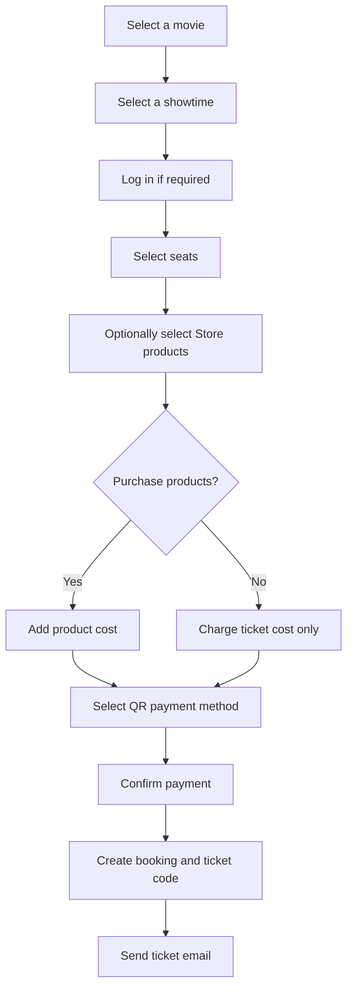
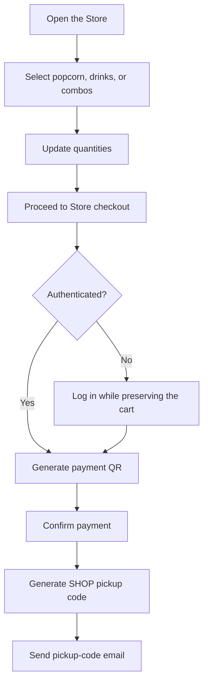
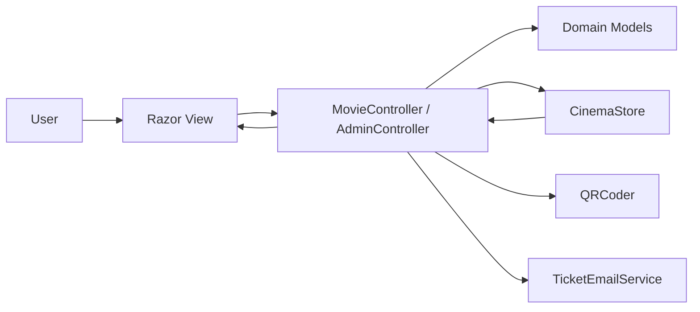
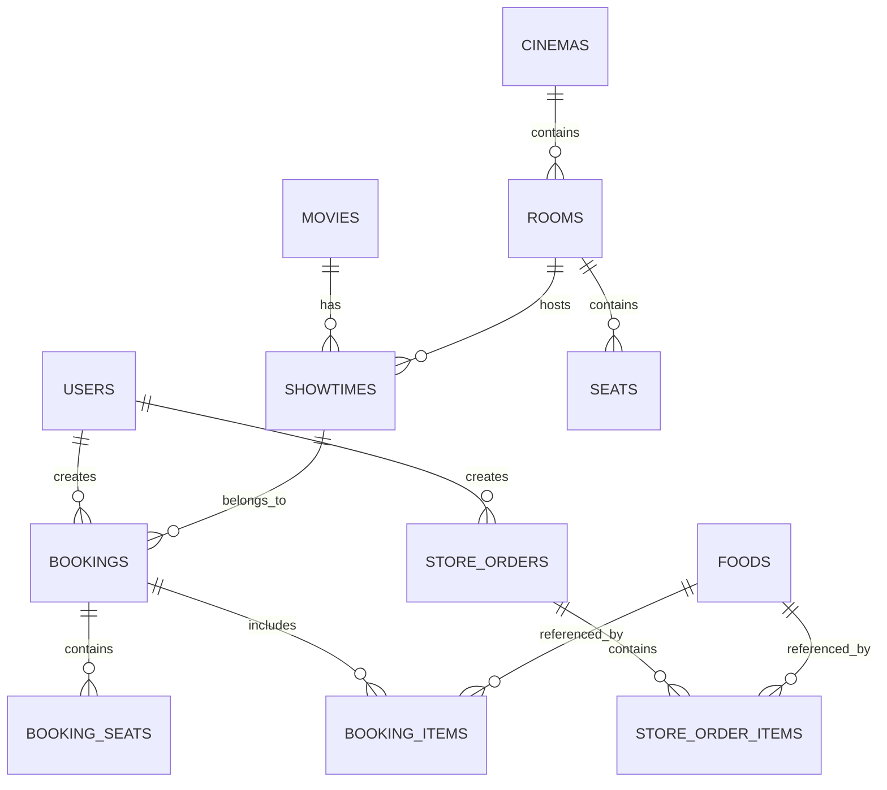

# HO CHI MINH CITY UNIVERSITY OF TECHNOLOGY (HUTECH)

## FACULTY OF INFORMATION TECHNOLOGY

### FOUNDATION PROJECT - INTERNATIONAL PROGRAM  
### HUTECH UNIVERSITY INTERNATIONAL

---

# FOUNDATION PROJECT REPORT

## PROJECT TITLE: WEB MOVIETICKET

**Supervisor:** Nguyen Huy Cuong  
**Project group:** Group 2  
**Academic year:** 2025 - 2026

| No. | Full name | Student ID |
|---:|---|---:|
| 1 | Dang Le Thai Phong | 2380604964 |
| 2 | Son Nhat Hoang | 2380600742 |
| 3 | Nguyen Dinh Phuoc | 2380601769 |

**Ho Chi Minh City, June 2026**

---

# ACKNOWLEDGEMENTS

Group 2 would like to express our sincere gratitude to our supervisor, Mr. Nguyen Huy Cuong, for his guidance, feedback, and support throughout the development of the foundation project entitled **Web MovieTicket**.

This project gave us an opportunity to apply our knowledge of web development, the MVC architectural pattern, user interface design, cinema ticket booking, account management, QR payment, email delivery, and system administration. The development process also helped us understand how to analyze requirements, organize source code, test workflows, and complete a web application with practical business processes.

Due to the limited development time and our current experience, the report and application may still contain shortcomings. We look forward to receiving feedback from our supervisor so that the system can be improved in future versions.

---

# SUPERVISOR'S COMMENTS

............................................................................................

............................................................................................

............................................................................................

............................................................................................

**Grade:** .................................................................................

**Supervisor's signature:** .................................................................

---

# TABLE OF CONTENTS

1. Project Overview  
2. Requirements Survey and Analysis  
3. System Analysis and Design  
4. Technologies and Implementation  
5. Results, Testing, and Evaluation  
6. Conclusion and Future Development  
7. References  
8. Appendices  

---

# CHAPTER 1. PROJECT OVERVIEW

## 1.1. Reasons for Choosing the Topic

Going to the cinema is a common entertainment activity, while customers increasingly expect to search for movies, select showtimes and seats, and complete payments without waiting at a physical counter. In addition to tickets, cinemas also sell popcorn, beverages, and combination packages.

Based on these practical needs, our group chose to develop **Web MovieTicket**, an online movie ticket booking website under the simulated brand **PHP Cinema**. The system aims to provide a modern, convenient, and responsive experience on desktop computers, tablets, and mobile devices.

## 1.2. Project Objectives

- Develop a website for presenting and searching for movies.
- Display currently showing, popular, upcoming, and early-access movies.
- Allow users to view movie details, cinemas, and showtime schedules.
- Support account registration, login, and user sessions.
- Implement the complete process of selecting a showtime, choosing seats, and making a payment.
- Support simulated bank QR, MoMo, ZaloPay, and VNPay payments.
- Deliver electronic tickets or Store pickup codes by email.
- Provide an independent Store for popcorn, drinks, and combo products.
- Develop an administration dashboard with appropriate management permissions.
- Create an attractive, responsive, and Vietnamese-compatible interface.

## 1.3. Project Scope

### Implemented Scope

- Management and presentation of 20 movies with poster images.
- Movie pagination, keyword search, and genre filtering.
- An automatically sliding featured-movie banner.
- Event, promotion, popular movie, upcoming movie, and early-access sections.
- Cinema, screening room, and showtime information.
- Standard and VIP seat selection.
- Optional popcorn, beverage, and combo selection during ticket booking.
- A Store that can be used independently without purchasing a movie ticket.
- QR generation for multiple payment methods.
- Electronic ticket and Store pickup-code generation.
- Email delivery through SMTP with an HTML preview fallback.
- Management of movies, cinemas, showtimes, events, users, and booking statuses.
- Persistent JSON state storage across application restarts.
- Direct movie poster upload from the administrator's computer.
- Referential protection that prevents the deletion of movies or showtimes with related ticket data.

### Current Limitations

- The system uses `CinemaStore` together with `App_Data/cinema-state.json` for persistent storage instead of SQL Server as its primary production database.
- JSON storage is suitable for a foundation project and a single web process, but not for high traffic or multiple application servers.
- Payment QR codes are simulations and are not connected to real Merchant APIs or payment webhooks.
- Actual email delivery requires valid SMTP settings in `Web.config`.
- Automatic refund and transaction cancellation functions have not been implemented.

## 1.4. System Users

### Guest Users

- View movie lists and movie details.
- Search and filter movies.
- View cinemas, schedules, events, and promotions.
- Browse and select Store products.
- Register or log in.

### Authenticated Customers

- Use all guest functions.
- Select showtimes and seats.
- Purchase movie tickets with optional food and beverages.
- Purchase Store products without buying a ticket.
- Make simulated QR payments.
- View purchased tickets and Store orders.
- Receive tickets and pickup codes by email.

### Administrators

- View the system overview and dashboard.
- Add, update, and remove movies.
- Manage cinemas and screening rooms.
- Manage showtimes.
- Manage events and promotions.
- View users and assign roles.
- View bookings, revenue, and ticket statuses.

---

# CHAPTER 2. REQUIREMENTS SURVEY AND ANALYSIS

## 2.1. Functional Requirements

| ID | Function | Description |
|---|---|---|
| F01 | Registration | Creates a new customer account |
| F02 | Login | Authenticates a user and creates a session |
| F03 | Movie listing | Displays movie posters, information, and status |
| F04 | Movie search | Searches by movie title or genre |
| F05 | Genre filter | Displays movies belonging to a selected genre |
| F06 | Pagination | Divides a large movie list into pages |
| F07 | Movie details | Displays description, duration, director, cast, and rating |
| F08 | Showtime schedule | Displays date, time, cinema, and screening room |
| F09 | Seat selection | Selects available standard or VIP seats |
| F10 | Concession selection | Selects popcorn, drinks, or combos with a ticket |
| F11 | Independent Store | Purchases Store products without a movie ticket |
| F12 | QR payment | Generates bank, MoMo, ZaloPay, or VNPay QR codes |
| F13 | Ticket history | Displays ticket codes and showtime information |
| F14 | Store order history | Displays pickup codes and ordered products |
| F15 | Email delivery | Sends tickets or pickup codes to customer email addresses |
| F16 | Movie administration | Allows administrators to add, edit, upload posters, deactivate, or validly delete movies |
| F17 | Cinema administration | Allows administrators to add, update, and delete cinemas |
| F18 | Showtime administration | Allows administrators to create and manage showtimes |
| F19 | Event administration | Allows administrators to manage promotions |
| F20 | User administration | Allows administrators to view users and assign roles |

## 2.2. Non-functional Requirements

- The interface must be clear, modern, and visually consistent.
- The website must work properly on desktops, tablets, and mobile devices.
- User input must be validated on the server.
- POST forms must use anti-forgery tokens to reduce CSRF risks.
- Sample passwords must be hashed before being stored in memory.
- Normal customers must not be able to access administration pages.
- The server must verify selected seats before payment.
- Product quantity must be limited to a valid range.
- Payment QR codes must have an expiration time to simulate real transactions.
- If SMTP is unavailable, the system must still create a ticket and save an HTML email preview.
- Administration, account, booking, and Store changes must be persisted to a JSON state file.
- Uploaded posters must be JPG/PNG files no larger than 5 MB and at least 200 x 300 pixels.
- Movies with showtimes or issued tickets must not be permanently deleted.

## 2.3. Ticket Booking Workflow



## 2.4. Independent Store Workflow



## 2.5. Access Control

| Function | Guest | Customer | Administrator |
|---|:---:|:---:|:---:|
| View movies, cinemas, and events | Yes | Yes | Yes |
| Search and filter movies | Yes | Yes | Yes |
| Select Store products | Yes | Yes | Yes |
| Complete payment | No | Yes | Yes |
| View tickets and Store orders | No | Yes | Yes |
| Manage movies, cinemas, and showtimes | No | No | Yes |
| Assign user roles | No | No | Yes |

---

# CHAPTER 3. SYSTEM ANALYSIS AND DESIGN

## 3.1. MVC Architecture

The system is developed with ASP.NET MVC:

- **Model:** defines movies, users, cinemas, rooms, showtimes, seats, bookings, products, and Store orders.
- **View:** uses Razor `.cshtml` templates to display data and receive user interactions.
- **Controller:** processes requests, validates data, performs business logic, and communicates with the data store.



## 3.2. Main Data Classes

| Class | Responsibility |
|---|---|
| `Movy` | Stores movie information |
| `Cinema` | Stores cinema information |
| `Room` | Represents a screening room belonging to a cinema |
| `ShowTime` | Stores screening date, start time, and price |
| `Seat` | Stores seat name and seat type |
| `User` | Stores account and role information |
| `Booking` | Stores a movie ticket transaction |
| `ConcessionProduct` | Stores popcorn, beverage, and combo information |
| `ConcessionOrderItem` | Stores a selected product, quantity, and price |
| `StoreOrder` | Stores an independent Store transaction |
| `Event` | Stores event and promotion information |

## 3.3. Current Persistence Mechanism

On the first application start, `CinemaStore` creates the built-in seed data in memory. After every modifying operation, including movie editing, account registration, ticket booking, and Store ordering, the required application state is serialized to:

```text
MovieTicketDB/App_Data/cinema-state.json
```

When IIS Express or the website restarts, the application reads the JSON file and reconnects the relationships among movies, cinemas, rooms, and showtimes. Therefore, administrator changes and transactions are no longer lost when the website stops.

The state file is excluded through `.gitignore` because it contains operational user data and hashed passwords.

## 3.4. Proposed SQL Server Data Model



### Proposed Tables

- `Users(UserID, UserName, FullName, Email, Phone, PasswordHash, Role)`
- `Movies(MovieID, Title, Description, Duration, Genre, Poster, Director, Rating, Status)`
- `Cinemas(CinemaID, CinemaName, Address, Description)`
- `Rooms(RoomID, CinemaID, RoomName)`
- `ShowTimes(ShowTimeID, MovieID, RoomID, ShowDate, StartTime, Price)`
- `Seats(SeatID, RoomID, SeatName, Type)`
- `Bookings(BookingID, UserID, ShowTimeID, TotalMoney, PaymentMethod, Status, Code)`
- `BookingSeats(BookingID, SeatID, Price)`
- `Foods(FoodID, FoodName, Category, Price, Image)`
- `BookingItems(BookingID, FoodID, Quantity, UnitPrice)`
- `StoreOrders(OrderID, UserID, TotalMoney, PaymentMethod, Status, Code)`
- `StoreOrderItems(OrderID, FoodID, Quantity, UnitPrice)`
- `Events(EventID, Title, Description, Image, EndDate)`

## 3.5. Store Data Design

The Store currently contains 17 products divided into three groups:

- **Popcorn:** small, medium, and large butter popcorn; cheese popcorn; caramel popcorn.
- **Drinks:** small and large Coca-Cola, Pepsi, 7 Up, peach tea, and bottled water.
- **Combos:** Solo, Couple, Family, VIP, Kids, and Sweet.

Each product contains an identifier, name, category, description, price, accent color, and image path. Product prices are always retrieved and validated on the server to prevent price manipulation through browser-side JavaScript.

## 3.6. User Interface Design

The website uses a dark color scheme with orange-red accent colors. Its main design components include:

- A fixed header with the PHP Cinema logo.
- An automatically sliding featured-movie banner.
- Movie cards using real poster images.
- Store cards using product images.
- A visual cinema seating map.
- A payment page divided into order information and a QR panel.
- An administration dashboard with data tables.
- Responsive media queries for smaller screens.

---

# CHAPTER 4. TECHNOLOGIES AND IMPLEMENTATION

## 4.1. Technologies Used

| Technology | Purpose |
|---|---|
| ASP.NET MVC 5.2.9 | Builds the web application with the MVC pattern |
| .NET Framework 4.7.2 | Provides the application runtime |
| C# | Implements server-side business logic |
| Razor View Engine | Combines HTML templates with model data |
| HTML5 and CSS3 | Builds page structure and presentation |
| JavaScript | Implements sliders, carts, seat selection, and dynamic totals |
| PagedList.Mvc | Implements movie pagination |
| QRCoder 1.4.3 | Generates payment QR codes |
| SMTP | Delivers tickets and Store pickup codes by email |
| IIS Express | Runs and tests the application locally |

## 4.2. Project Structure

```text
MovieTicketDB/
├── Controllers/
│   ├── MovieController.cs
│   └── AdminController.cs
├── Models/
│   ├── DomainModels.cs
│   ├── ViewModels.cs
│   └── CinemaStore.cs
├── Services/
│   └── TicketEmailService.cs
├── Views/
│   ├── Movie/
│   ├── Admin/
│   └── Shared/
├── Content/
│   ├── Site.css
│   └── images/
├── App_Data/
│   ├── cinema-state.json
│   └── MailDrop/
└── Web.config
```

## 4.3. Movie Listing Implementation

The home page receives the `search`, `genre`, and `page` parameters. Movie data is first searched by title or genre, then filtered by the selected genre, and finally divided into pages containing eight movies each.

In addition to the main movie list, the ViewModel provides:

- Featured movies for the home-page banner.
- Popular movies ordered by rating.
- Upcoming movies ordered by release date.
- Early-access movies.
- Events and promotions.

## 4.4. Seat Selection Implementation

The system generates a seating map with five rows from A to E. Row E contains VIP seats with a higher price. During seat selection:

1. JavaScript immediately updates the selected seat list and total cost.
2. The server verifies that each seat belongs to the correct room.
3. The server verifies that the seat has not already been booked.
4. If no valid seat remains, the user is redirected to select seats again.

Server-side verification reduces the risk of users modifying seat information in the browser.

## 4.5. Store Implementation

The Store supports two different business scenarios.

### Products Purchased with a Ticket

After selecting seats, the customer may add products or select **Skip and pay for tickets only**. Product costs are added to the QR payment total and stored with the booking.

### Independent Store Purchase

A customer may open the Store directly from the navigation menu without selecting a movie. If the customer is not logged in, the selected cart is temporarily stored in Session and restored after successful authentication.

The system generates a code beginning with `SHOP` so that the customer can collect the products at a PHP Cinema counter.

## 4.6. QR Payment Implementation

The system offers four payment options:

- Bank QR.
- MoMo.
- ZaloPay.
- VNPay QR.

The QR payload contains the receiver, order code, total amount, and ticket or product information. QRCoder generates the QR image, which is converted to a Base64 string and displayed directly in the payment page.

The current implementation is a simulation. A production system would require:

- A Merchant account.
- A transaction creation API.
- A digital signature or authentication mechanism.
- A payment-provider webhook.
- Protection against false client-side payment confirmations.

## 4.7. Email Implementation

`TicketEmailService` creates an HTML email containing:

- Customer name.
- Ticket code or Store pickup code.
- Movie, cinema, room, seat, and showtime information.
- Popcorn, beverage, or combo details.
- Payment method and total amount.

When SMTP is configured, the email is delivered to the customer. If SMTP is disabled or an error occurs, the system saves an HTML preview in:

```text
MovieTicketDB/App_Data/MailDrop
```

## 4.8. Authentication and Authorization

The application uses Session to store:

- `UserID`
- `UserName`
- `FullName`
- `Role`

The system contains two roles:

- `Customer`: uses ticket booking and Store functions.
- `Admin`: accesses the administration dashboard.

Data-changing POST forms use `ValidateAntiForgeryToken`.

## 4.9. Administration Dashboard

The Admin section provides:

- Total booking revenue.
- Movie and showtime statistics.
- User lists.
- Booking lists.
- Movie creation, editing, poster upload, status changes, and valid deletion.
- Event creation, editing, and deletion.
- Cinema creation, editing, and deletion.
- Showtime creation, editing, and deletion.
- Automatic showtime rebuilding.
- User role assignment.
- Booking status updates.

### Poster Upload from the Administrator's Computer

The movie form uses `multipart/form-data` and `HttpPostedFileBase`. An administrator may select an image directly from Documents or any local directory. The server:

1. Accepts JPG, JPEG, or PNG extensions.
2. Limits file size to 5 MB.
3. Verifies that the content is a valid image.
4. Requires a minimum resolution of 200 x 300 pixels.
5. Generates a unique filename and saves it in `Content/images`.
6. Preserves the old poster when no new file is selected.

### Movie and Showtime Deletion Rules

- A movie with existing showtimes cannot be deleted.
- A movie with issued tickets must remain available for transaction history.
- A showtime with issued tickets cannot be deleted.
- An administrator can change a historical movie to **Discontinued** (`Ngừng chiếu`). It is hidden from customers while remaining available in Admin and ticket records.
- Rebuilding all showtimes is blocked after bookings exist to protect ticket-to-showtime relationships.

---

# CHAPTER 5. RESULTS, TESTING, AND EVALUATION

## 5.1. Achieved Results

The group completed the application's primary business workflows:

- Movie search, filtering, and pagination.
- Movie details, cinema information, showtimes, and events.
- Registration, login, and role-based access control.
- Seat selection and price calculation.
- Optional popcorn, drinks, and combos.
- Independent Store ordering.
- Simulated QR payment.
- Ticket, pickup-code, and email generation.
- System content and data administration.

## 5.2. Test Cases

| No. | Test Case | Expected Result | Result |
|---:|---|---|---|
| 1 | Open the home page | Banner and movie list are displayed | Passed |
| 2 | Search by movie title | Only matching results are displayed | Passed |
| 3 | Filter by genre | Movies of the selected genre are displayed | Passed |
| 4 | Change movie page | The selected page is displayed | Passed |
| 5 | Select an available seat | Seat and total are updated | Passed |
| 6 | Submit without a seat | The system displays an error | Passed |
| 7 | Skip Store during booking | Product total remains zero | Passed |
| 8 | Add products to a ticket | QR total includes ticket and product costs | Passed |
| 9 | Purchase Store products without a movie | An independent Store order is created | Passed |
| 10 | Select Store products before login | The cart is preserved after login | Passed |
| 11 | Confirm QR payment | A Booking or StoreOrder is created | Passed |
| 12 | Use the system without SMTP | An HTML email preview is saved | Passed |
| 13 | Log in as Administrator | The user is redirected to the Admin dashboard | Passed |
| 14 | Open Admin page as Customer | Access is denied | Passed |
| 15 | Display Store product images | All 17 product records have valid images | Passed |
| 16 | Edit a movie and restart IIS | The edited information remains available | Passed |
| 17 | Upload a JPG poster | The file is stored and assigned to the movie | Passed |
| 18 | Delete a movie with showtimes | The system blocks deletion and explains why | Passed |
| 19 | Delete a showtime with tickets | The system refuses the deletion | Passed |
| 20 | Mark a movie as discontinued | The movie is hidden from customers while history remains | Passed |

## 5.3. Strengths

- The interface has a consistent visual identity and modern presentation.
- The ticket booking workflow is relatively complete.
- Store purchases are optional and can also be completed independently.
- Important business rules are verified on the server.
- Customer and Administrator roles are separated.
- QR and email features provide a realistic transaction simulation.
- Source code is organized into Controllers, Models, Views, and Services.

## 5.4. Current Weaknesses

- SQL Server is not yet the primary store; JSON has limitations for querying and concurrent writes.
- Entity Framework and the Repository Pattern are not currently used.
- QR payments are not verified through webhooks.
- Passwords currently use SHA-256 without a salt instead of a dedicated password-hashing algorithm such as BCrypt.
- Password recovery has not been implemented.
- Store inventory is not managed.
- Discount codes and membership points are not available.
- Automated unit tests have not been added.

---

# CHAPTER 6. CONCLUSION AND FUTURE DEVELOPMENT

## 6.1. Conclusion

The **Web MovieTicket** project has achieved the main objectives of the foundation project. The group developed a modern movie ticket booking website that supports movie discovery, seat selection, optional Store products, QR payment, ticket generation, and system administration.

Through the project, the group strengthened its knowledge of ASP.NET MVC, C#, Razor, HTML, CSS, JavaScript, Session, authorization, QR generation, and SMTP. The completed application can serve as a foundation for a more advanced production cinema management and ticketing platform.

## 6.2. Future Development

- Migrate JSON persistence to SQL Server for production use.
- Use Entity Framework Code First.
- Add foreign-key constraints and database transactions for seat booking.
- Integrate a real payment gateway.
- Verify transactions through provider webhooks.
- Use BCrypt or ASP.NET Identity for password security.
- Add password recovery and email verification.
- Add Store inventory management.
- Add vouchers, reward points, and membership tiers.
- Support different seating layouts for different room types.
- Add revenue reports by day, month, cinema, and movie.
- Generate PDF invoices.
- Add unit and integration tests.
- Deploy the website to IIS or a cloud platform.

---

# TASK ASSIGNMENT

| Member | Student ID | Assigned Work |
|---|---:|---|
| Dang Le Thai Phong | 2380604964 | Requirement analysis; ticket booking workflow; QR payment; system integration |
| Son Nhat Hoang | 2380600742 | User interface design; movie pages; banner; responsive layout; visual assets |
| Nguyen Dinh Phuoc | 2380601769 | Store development; account functions; testing; report completion |

All members participated in discussions, testing, debugging, and presentation preparation.

---

# REFERENCES

1. Microsoft, ASP.NET MVC Documentation.
2. Microsoft, .NET Framework 4.7.2 Documentation.
3. Microsoft, Razor Syntax Reference.
4. QRCoder Documentation, version 1.4.3.
5. PagedList.Mvc Documentation, version 4.5.0.
6. MDN Web Docs, HTML, CSS, and JavaScript.
7. Google, Gmail SMTP and App Password Documentation.

---

# APPENDIX A. APPLICATION SETUP GUIDE

## A.1. Environment Requirements

- Windows 10 or Windows 11.
- Visual Studio 2022.
- ASP.NET and web development workload.
- .NET Framework 4.7.2.
- IIS Express.

## A.2. Running the Application

1. Open the project solution in Visual Studio.
2. Wait for Visual Studio to restore NuGet packages.
3. Set `MovieTicketDB` as the Startup Project.
4. Press `Ctrl + F5` or select the IIS Express launch button.
5. Open the PHP Cinema home page in a browser.

## A.3. Sample Accounts

| Role | Username | Password |
|---|---|---|
| Customer | `demo` | `123456` |
| Administrator | `admin` | `admin123` |

## A.4. SMTP Configuration

Open `MovieTicketDB/Web.config` and update:

```xml
<add key="SmtpEnabled" value="true" />
<add key="SmtpHost" value="smtp.gmail.com" />
<add key="SmtpPort" value="587" />
<add key="SmtpEnableSsl" value="true" />
<add key="SmtpUsername" value="your-email@gmail.com" />
<add key="SmtpPassword" value="your-app-password" />
<add key="SmtpFrom" value="your-email@gmail.com" />
<add key="SmtpDisplayName" value="PHP Cinema" />
```

Real credentials must not be included in the report or committed to Git.

---

# APPENDIX B. PROJECT DEMONSTRATION SCRIPT

1. Open the home page and introduce the automatic banner.
2. Search for a movie and filter movies by genre.
3. Open a movie detail page and view its showtimes.
4. Log in with the `demo` account.
5. Select a showtime and an available seat.
6. Select a Store product or skip the Store step.
7. Select a QR payment method and confirm payment.
8. Open My Tickets and verify the ticket code.
9. Open the Store and purchase products without selecting a movie.
10. Open My Store Orders and verify the pickup code.
11. Log out and log in using the `admin` account.
12. Introduce the dashboard and administration functions.
13. Edit a movie, upload a poster from the computer, and verify the new image.
14. Explain why deletion is disabled for movies with showtimes or ticket history.

---

# APPENDIX C. EXPECTED PRESENTATION QUESTIONS

## Why did the group use the MVC pattern?

MVC separates user interface code, data models, and business logic. This separation improves maintainability, testing, and future development.

## Why must product prices be verified on the server?

Browser-side JavaScript can be modified by a user. The server must retrieve official product prices from the product catalog to prevent price manipulation.

## Why is StoreOrder separated from Booking?

A Booking is always connected to a movie, showtime, and seat, while a StoreOrder can be purchased independently. Separating the two entities keeps the business model clear and prevents the system from creating a false movie ticket for a food-only purchase.

## Does the current QR code complete a real payment?

No. The current QR code simulates payment data. A production system requires a Merchant API and a webhook to verify that money has actually been received.

## Is data still lost when the application restarts?

No. The current version writes application state to `App_Data/cinema-state.json` after each change and reloads it during startup. SQL Server remains the recommended production upgrade.

## Why can a movie with issued tickets not be deleted?

A ticket is a transaction record that must continue to reference its movie, showtime, cinema, and seats. Deleting these records would break historical integrity. The system therefore uses the **Discontinued** status to hide the movie from customers instead of permanently deleting it.

## How is poster upload validated?

The server accepts only JPG or PNG files, limits each file to 5 MB, validates that the content is a real image, and requires a minimum resolution of 200 x 300 pixels. A unique filename is generated before storage.

## How does the system prevent duplicate seat booking?

Before displaying the payment page, the server verifies that each seat belongs to the selected room and has not already appeared in a booking for the showtime. With a production database, a transaction and database constraints should also be used to handle concurrent customers.
